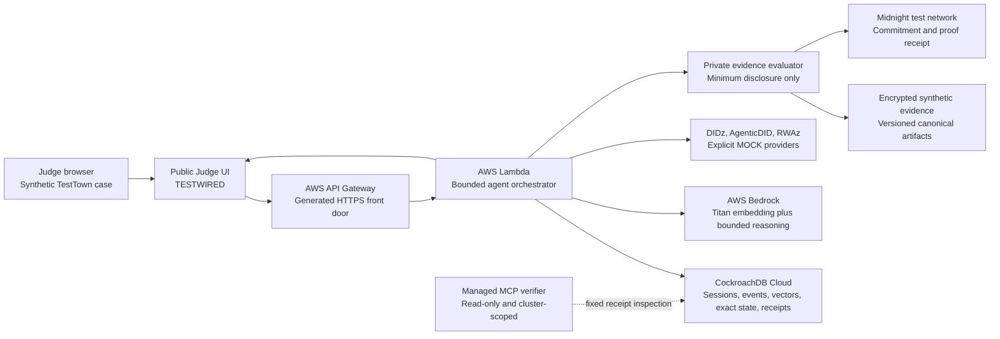

# Architecture diagram

## The three planes

### Memory plane

CockroachDB stores the durable session history, append-only events, privacy-safe
summaries, vectors, exact property state, rebuild generations, and receipts. It is
the system a fresh agent process uses to resume work.

### Trust plane

Midnight verifies commitments or a narrow private predicate on a real test network.
It does not store the private deed or replace CockroachDB. DIDz, AgenticDID, and
RWAz are synthetic mock adapters for this submission.

### Execution plane

API Gateway gives the browser an HTTPS front door. Lambda performs bounded,
allowlisted orchestration. Bedrock creates privacy-safe embeddings and the bounded
agent explanation. Secrets remain server-side.

## Critical rule

Semantic memory can locate relevant context. It can never grant authority.
Authorization and the private predicate are separately verified before anything
protected is disclosed.
