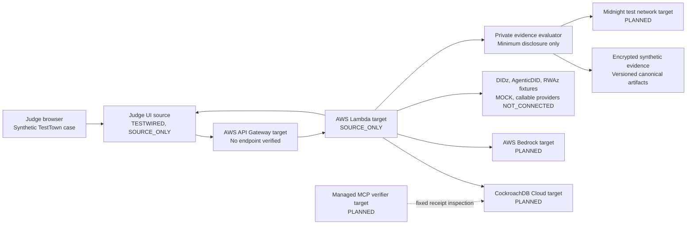

# Architecture diagram

> This diagram shows the target TestWired topology, not verified current
> connectivity. The UI and AWS infrastructure exist as source, no public
> endpoint is verified, and every external provider remains `SOURCE_ONLY`,
> `PLANNED`, or `NOT_CONNECTED`. See
> [IMPLEMENTATION_STATUS.md](IMPLEMENTATION_STATUS.md).

## The three planes

### Target memory plane

CockroachDB will store the durable session history, append-only events,
privacy-safe summaries, vectors, exact property state, rebuild generations, and
receipts. It will be the system a fresh agent process uses to resume work.

### Target trust plane

Midnight will verify commitments or a narrow private predicate on a supported
test network. It will not store the private deed or replace CockroachDB. DIDz,
AgenticDID, and RWAz remain synthetic mock fixtures in the target submission.

### Target execution plane

API Gateway will give the browser an HTTPS front door. Lambda will perform
bounded, allowlisted orchestration. Bedrock will create privacy-safe embeddings
and the bounded agent explanation. Secrets will remain server-side.

## Critical rule

Semantic memory can locate relevant context. It can never grant authority.
Authorization and the private predicate are separately verified before anything
protected is disclosed.
