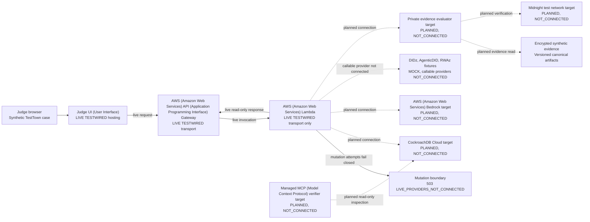

# Architecture diagram

> This diagram separates the current live TestWired transport from planned
> provider connectivity. The UI (User Interface), AWS (Amazon Web Services)
> API (Application Programming Interface) Gateway and AWS (Amazon Web Services)
> Lambda transport are live with synthetic data. The global `deploymentEvidence` value remains
> `SOURCE_ONLY`; downstream providers remain `PLANNED` or `NOT_CONNECTED`. See
> [IMPLEMENTATION_STATUS.md](IMPLEMENTATION_STATUS.md).

## Current verified transport

| Surface | Current evidence |
| --- | --- |
| AWS (Amazon Web Services) application stack | `mhelixctw-testwired` is `CREATE_COMPLETE`. |
| API (Application Programming Interface) | <https://iyoshkil91.execute-api.us-east-1.amazonaws.com> |
| Amplify origin | <https://main.d23ghemtd40rom.amplifyapp.com> |
| Custom UI (User Interface) | <https://testwired.helixctw.com> |

Only the AWS (Amazon Web Services) transport and public UI (User Interface)
hosting are live. CockroachDB, AWS (Amazon Web Services) Bedrock, Midnight, and
Managed MCP (Model Context Protocol) are planned and disconnected. Valid mutations return `503 LIVE_PROVIDERS_NOT_CONNECTED` and
fail closed, so the global `deploymentEvidence` value remains `SOURCE_ONLY`.

## The three planes

### Target memory plane

CockroachDB will store the durable session history, append-only events,
privacy-safe summaries, vectors, exact property state, rebuild generations, and
receipts. It will be the system a fresh agent process uses to resume work. This
provider is currently planned and disconnected.

### Target trust plane

Midnight will verify commitments or a narrow private predicate on a supported
test network. It will not store the private deed or replace CockroachDB. DIDz,
AgenticDID, and RWAz remain synthetic mock fixtures in the target submission.
The Midnight provider and private evaluator are currently planned and
disconnected.

### Current transport and target execution plane

API (Application Programming Interface) Gateway currently gives the browser a
live HTTPS (Hypertext Transfer Protocol Secure) front door, and AWS (Amazon Web
Services) Lambda serves the bounded transport contract. Downstream orchestration
is not connected, so mutation requests fail closed.
AWS (Amazon Web Services) Bedrock is planned to create privacy-safe embeddings
and the bounded agent explanation. Secrets will
remain server-side.

## Critical rule

Semantic memory can locate relevant context. It can never grant authority.
Authorization and the private predicate are separately verified before anything
protected is disclosed.
